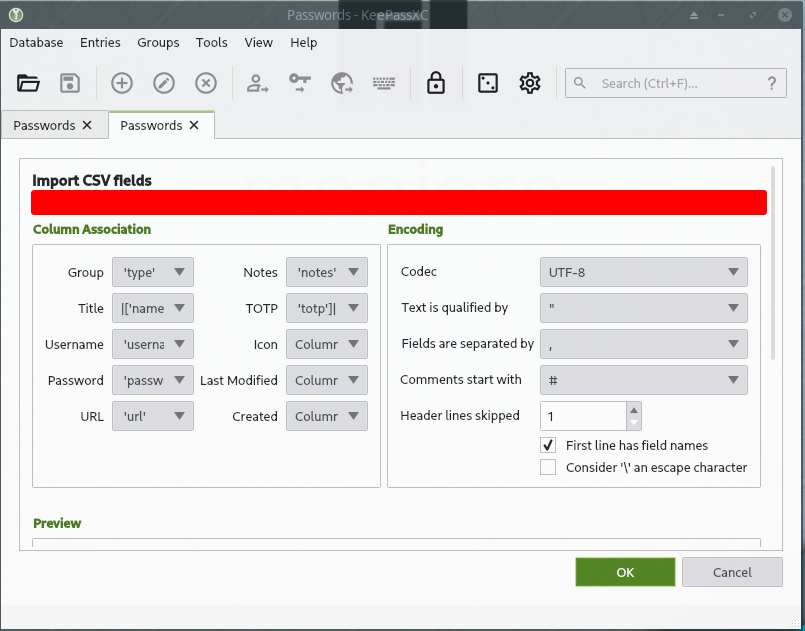

# PMMST - Password Manager Migration Support Tool

High and time-consuming migration-costs between Password Managers has led to deceptive and ever-changing pricing models, usually converging towards a subscription model of some kind. This tool is intended to help you to migrate your passwords from one password manager to another, specifically supporting migration towards KeePassXC.


## Overview

* media/ - Images and other media files
* README.md - This file
* JSON2CSV.py - Script to convert JSON to CSV.

## Usage

0. Create a secure and air-tight environment such as a VM or a container.
1. Export or backup your passwords locally as a .JSON file.
2. Configure the setup variables within the script:

```
EXPANDNOTES    = True                      # Merge incompatible fields into notes.
FILE           = 'passwords.json'          # Password backup/export file.
CSVNAME        = 'passwordsProcessed.csv'  # Processed passwords output file.
REMOVE         = []                        # Fields to remove.
VALID          = []                        # Only use fields that are valid for KeePass.
```
3. Run: ``python JSON2CSV.py``
4. Import as .CSV into KeePassXC.

5. Completely delete all password files. Also within the bin or cloud backups!

## KeePassXC

KeePassXC is Free and Open Source Software (FOSS) and is developed by [KeePassXC Team](https://keepassxc.org/). It supports most platforms and is available for free download [here](https://keepassxc.org/).

### Import Compatibility

* It would be nice if custom fields were automatically created during the import process. But this is not the case yet.
* It would be convenient if new lines for notes were substituteable with a tag or character such as `<BR>`.

## Contributing

Contributions are very welcome. In particular, it can be imagined that a smaller adjustment to the code could be made to make it useful for a wider range of PMs. Please feel free to submit a pull request if this is the case.